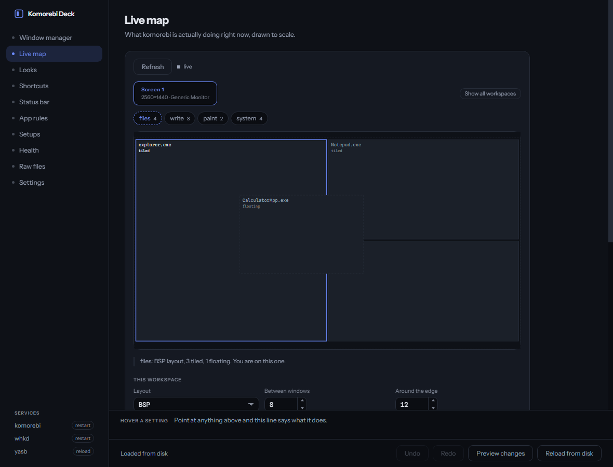
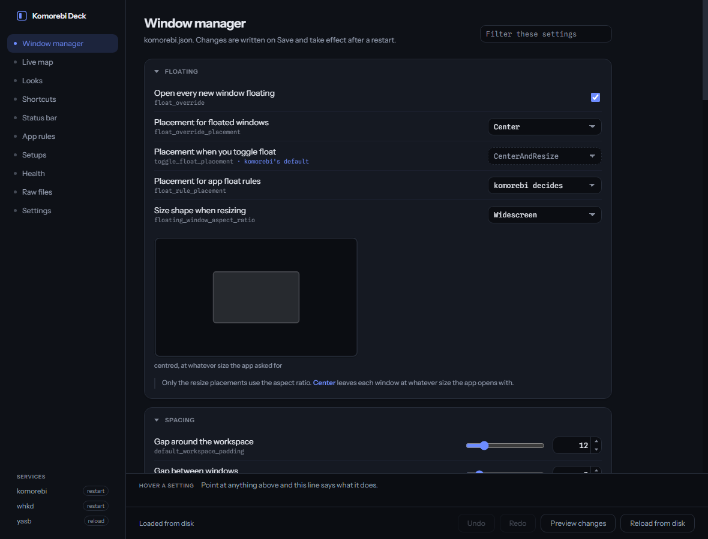

# Komorebi Deck

A desktop editor for [komorebi](https://github.com/LGUG2Z/komorebi),
[whkd](https://github.com/LGUG2Z/whkd) and [YASB](https://github.com/amnweb/yasb),
so you can change how your window manager behaves without hand-editing JSON and
finding out at the next restart whether you got it right.

It also draws what komorebi is doing right now, to scale, and lets you drag
windows between workspaces in that drawing.



## Getting it

Download the zip from [Releases](../../releases), unzip it anywhere, run
`Komorebi Deck.exe`. There is no installer, and nothing is written outside your
config files and `~/.config/komorebi-deck`. The download is about 110MB and
unzips to about 270MB, which is Electron rather than this app.

From source: `npm install && npm start`.

## What you need

komorebi. whkd and YASB are optional and only affect their own tab.

You do not have to install any of them yourself. A tab whose program is missing
says so, and the Tools section in Settings fetches it through winget, komorebi's
nightly channel included. Nothing is installed or updated without being asked,
and the latest versions are not looked up until you open that screen.

Ones you already have are found on your PATH, in scoop, in winget's links or in
Program Files, and versions are read from the tools themselves, so a scoop or
manual install reports honestly. Anything still missing can be pointed at by
hand, and that choice is remembered in `~/.config/komorebi-deck/paths.json`.

## What it edits

| Tab | File | Applying |
|---|---|---|
| Window manager | `komorebi.json` | restart komorebi |
| Live map | nothing, it drives komorebi directly | immediate |
| Looks | `komorebi.json` | most of it applies live |
| Shortcuts | `whkdrc` | restart whkd |
| Status bar | `config.yaml` | `yasbc reload` |
| App rules | `applications.json` | restart komorebi |
| Raw files | any of the above, plus the bar's `styles.css` | as above |

`KOMOREBI_CONFIG_HOME`, `WHKD_CONFIG_HOME` and `YASB_CONFIG_HOME` are followed
when you have them set.



More of it in [screenshots](screenshots): the border and colour settings, the
easing curve, the shortcut editor, the bar, app rules and the raw files.

**Save** writes to disk. **Save and apply** also restarts whatever needs
restarting, asking first before it touches komorebi, since that re-tiles every
window.

## The live map

Reads `komorebic state` and subscribes to komorebi's event pipe, so it follows
along as you work.

- Clicking a workspace shows it without switching you to it, so you can
  rearrange one from wherever you are.
- Drag a floating window and it moves on your actual screen while you hold it.
  Drag a corner to resize it.
- Drag any window onto a workspace button to send it there.
- Drag a tiled window at another one to stack them.

## Safety

Editing these files by hand is how you end up without a window manager, so:

- JSON and YAML are parsed before anything is written. A file that does not
  parse is refused rather than saved.
- Every write leaves the previous version beside it as `<name>.bak-<timestamp>`.
- Restarts report whether the process actually came back, and offer to put the
  previous config back if it did not.
- **Setups** keeps named copies of every config file, so you can switch between
  whole arrangements.

## Where the values come from

Dropdowns and defaults are both read out of `komorebic static-config-schema`,
from the komorebi you have installed, so they offer what your version accepts
rather than what mine did. `src/renderer/enums.js` is the fallback for when
komorebi cannot be reached, and was generated from 0.1.42.

Every key in `komorebi.json` is optional, and an absent one means komorebi
decides. Those rows show komorebi's own value and are marked as its rather than
yours, and nothing is written until you change it. Your config only ever gains
the decisions you actually made, and anything you leave alone keeps following
komorebi, including when a future version changes a default.

Two things komorebi wants in a shape you would not guess. Border colours are
Catppuccin palette names rather than hex, which is what the `theme` block
expects when `palette` is `Catppuccin`. And a custom easing curve is a bare
array of four numbers, `[0.4, 0, 0.2, 1]`, even though the schema describes it
as an object: komorebi reads that field by hand and only accepts a name or an
array.

## Getting around

**Ctrl+K** opens a palette over every setting in every tab, plus the tabs
themselves and what the footer and the rail do. It jumps to the setting and
marks it so you can see where you landed. The box in the corner of the Window
manager, Looks and Settings headers filters that tab in place instead.

Every section heading folds it away, and what you fold is remembered. Searching
opens whatever it matched for as long as the search runs, then puts your own
arrangement back when you clear it.

**Ctrl+Z** and **Ctrl+Y** undo and redo, sixty steps deep.

## Building

```bash
npm run build
```

Puts a zip in `dist/`. Pushing a `v*` tag does the same on GitHub and attaches
it to the release. The icon is `build/icon.ico`, generated by
`npx electron build/make-icon.js`, which renders the mark at seven sizes and
packs them; edit the artwork in that script rather than the .ico.

## Licence

MIT.
